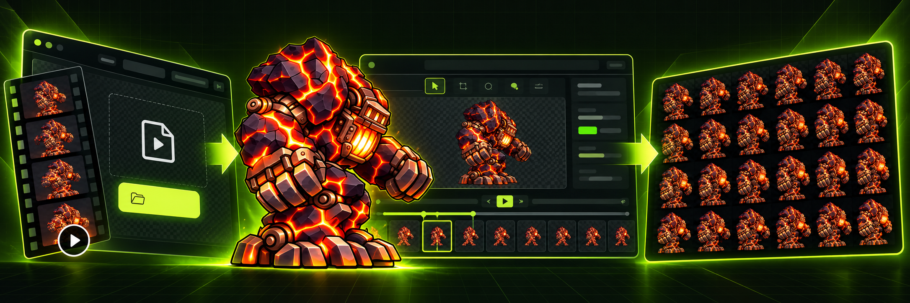
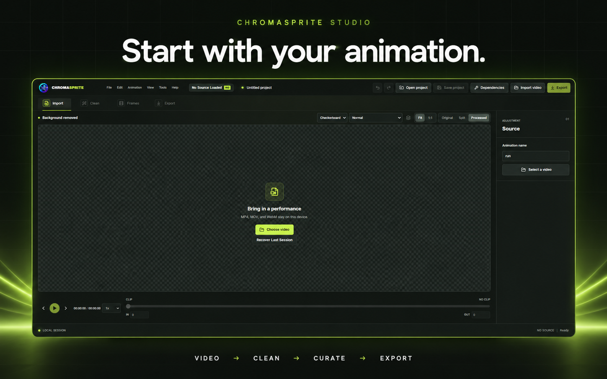
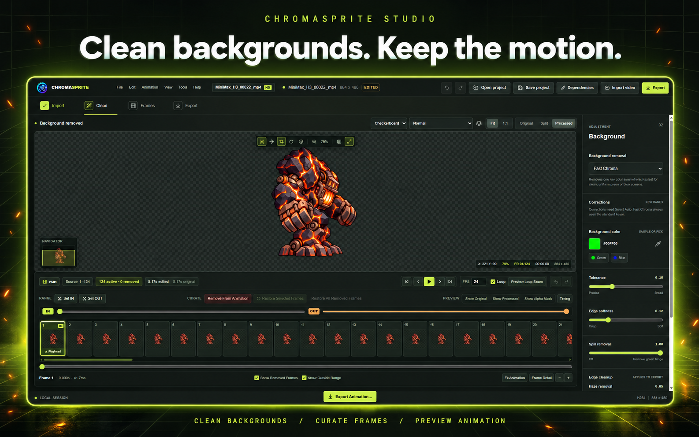

<h1 align="center">CHROMASPRITE STUDIO</h1>

<strong>Turn animation videos into clean, game-ready sprite sheets.</strong>

  

  
   
  Windows desktop · Early Access

<h3 align="center">Video → Clean → Curate → Export</h3>

<!-- Uncomment this block when a real workflow recording is available.

  

-->

## Great animation. Messy frames.

A video can look great in motion and still contain waiting frames, bad transitions, or an unwanted ending. Clean up the background and keep the frames that belong in your game.

**Keep the good motion. Remove the rest.**

  
  

Enhanced editor views · Click to enlarge · Original captures: <a href="docs/images/import.png">Import</a> / <a href="docs/images/editor.png">Editor</a>

### Clean Backgrounds

Remove unwanted backgrounds and refine frames before export.

### Frame-by-Frame Control

Inspect your animation, remove unwanted frames, and preview the motion before you export.

<!-- Uncomment this block when an actual exported sprite sheet is available.

  

-->

### Export Game-Ready Assets

Export transparent PNG frames and sprite sheets for your 2D game workflow.

<strong>Godot · Unity · 2D Games · Indie Developers</strong>

For game developers, 2D artists, and AI animation creators.

---

<h2 align="center">Early Access</h2>

Bring your animation. Clean it. Curate it. Export it.

  
   
  <a href="https://spriritualbeing.itch.io/chromasprite-studio">Download on itch.io →</a>

### Bug Reports

[Report a bug](https://github.com/vijay12481248-lab/ChromaSprite-Studio/issues/new?title=Bug%3A%20). Include the ChromaSprite Studio version, Windows version, video format, steps to reproduce, and expected versus actual result. Screenshots or a short recording help.

### Feature Requests

[Request a feature](https://github.com/vijay12481248-lab/ChromaSprite-Studio/issues/new?title=Feature%3A%20). Describe the problem, your current workflow, and how the feature would help. Mention your game engine if relevant.

### Early Access Notice

ChromaSprite Studio is currently in Early Access for Windows. Features and workflows may change as development continues. Get the latest available build from the [official itch.io page](https://spriritualbeing.itch.io/chromasprite-studio).
